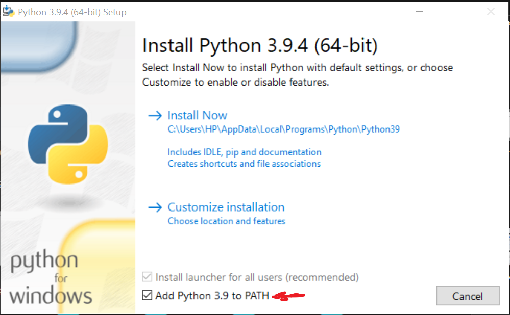

# Python Notes

This repo will contain short notes, snippets, challenges and solutions I encounter while learning Python.

## Why I'm learning Python

Javascript is a great language and I know enough to be dangerous (majorly React and some NodeJS on the backend). There's abundance of jobs with this stack. I would even argue most programming jobs come in this stack. Despite this, limiting myself to Javascript is a bad idea. Here's a few facts I've understood lately

- Extremely good engineers are not bound by languages
- More languages help build a stronger CS background
- Python is great for futuristic stuff

So I'm giving this a shot 🔫. I'll start by going atleast 2 hours daily and will begin with [this tutorial](https://www.youtube.com/playlist?list=PL-osiE80TeTt2d9bfVyTiXJA-UTHn6WwU)

The main reason I'm documenting these is to atleaset, help one person learning Python in the future.

---

## Installing Python on Windows


- Go to the [Python website](https://www.python.org/)
- Download the latest version
- Run the `exe`. Usually named `python-3.9.4-amd64.exe`

  > Ensure you check the `Add Python to PATH` option before installations.

   <br>

  

- To confirm installation, open command prompt and type `python --version`

> I'm aware there can be a lots of problems during installation, I'm thankful I haven't faced any yet. I'll update this document if I do.

## Running my first Python program

- Created a file `hello-world.py` and added the following
- compiled the typescript `python ./hello-world.py` in the terminal runs the code in the `hello-world.py` file.

```py
print('Hello world')

# outputs Hello World
```

## Working with Textual Data (Strings)

- Python does not use semi-colons 💃🏼 and operates on white spaces only
- `snake_case` is the convention for naming variables in python
- variables are declared without any keywords (That's weird coming from Javascript)

```py
hello_world = 'Hello world'
print(hello_world)
```

- print multi-sentence sentences by using triple semi-colons instead

```py
hello_message = """Paragraph across many
lines"""

print(hello_message)

# prints
# Hello world
```

- We can use single or double quotes interchangeably depending on if double or single quotes are used in the string

```py
hello_message = 'Hello"s world' # Single quotes because double quotes are used in sentence
hello_message2 = "Hello's world" # Double quotes because single quotes are used in sentence

print(hello_message)
print(hello_message2)

# prints
# Hello World
# Hello World
```

- We can escape characters too

```py
hello_message = 'Hello\' world'

print(hello_message)
# prints
# Hello' world
```

- get the length of a string with the `leng()` function

```py
hello_message = 'Hello world'

print(len(hello_message))
# prints 11
```

- **String indexes**: Strings are just like arrays and we can access characters at different indexes.

```py
hello_message = 'Hello world'

print(hello_message[0])
# prints H
```

### Strings Slicing in Python

- We can also print a range from a string. More like the `substr()` function in Javascript

```py
hello_message = 'Hello world'

# prints from 0 - 4th index of the string (excluding 4th index)
print(hello_message[0:4])
# prints Hell
```

- Leaving out the zero in the index will still produce the same result.

```py
hello_message = 'Hello world'

# prints from 0 - 4th index of the string (excluding 4th index)
print(hello_message[:4])

# prints from the 6th index to the end of the string
print(hello_message[6:])
# prints Hell
# prints world
```

- uppercase and lowercase strings with the `upper()` and `lower()` methods on the string. This is also very similar to what `toUpperCase()` and `toLowerCase()` in javascript.

```py
hello_message = 'Hello World'
print(hello_mesage.tolower())
print(hello_mesage.upper())

# prints
# hello world
# HELLO WORLD
```

- If we want to count the occurrence of characters in a string, we use the `count()` method

```py
hello_message = 'Hello world'
print(hello_message.count('l'))

# prints 3
```

- We can get the index of certain characters by using the `find()` method passing in the character to find. It prints the index of just the first occurrence and returns 0 if it doesn't exist.

```py
hello_message = 'Hello world'
print(hello_message.find('w'))
print(hello_message.find('z'))

# prints 3
# prints -1
```

- The `replace()` function exists to replace sections of a string

```py
hello_message = 'Hello World'

new_message = hello_message.replace('World', 'Universe')

print(new_message)

# prints Hello Universe
```

### Concatenating multiple strings

- We can format string output with the `format()` method to avoid manually concatenating strings

```py
greetings = 'Hello'
name = 'Micheal'
message = '{}, {}. Welcome!'.format(greeting, name)

print(message)
```

- `F-strings` in Python allow robust manipulation of strings. More like backticks in Javascript

> F-strings are available only in Python 3.6 and above

```py
greeting = 'Hello'
name = 'Micheal'

message = f'{greeting}, {name}. Welcome!'
print(message)
# Hello, Micheal. Welcome!

```

- We can also write code inside of the F-strings

```py
greeting = 'Hello'
name = 'Micheal'

message = f'{greeting}, {name.upper()}. Welcome!'
print(message)
# Hello, Micheal. Welcome!

```

### dir and help functions

- We can find out available functions on a function by using the `find` and `help` functions.

```py
name = 'Micheal'

# available methods on a string
print(dir(name))

# available methods on a type
print(help(str.lower))

# Prints out a lot of things 🤷🏼‍♀️
```
